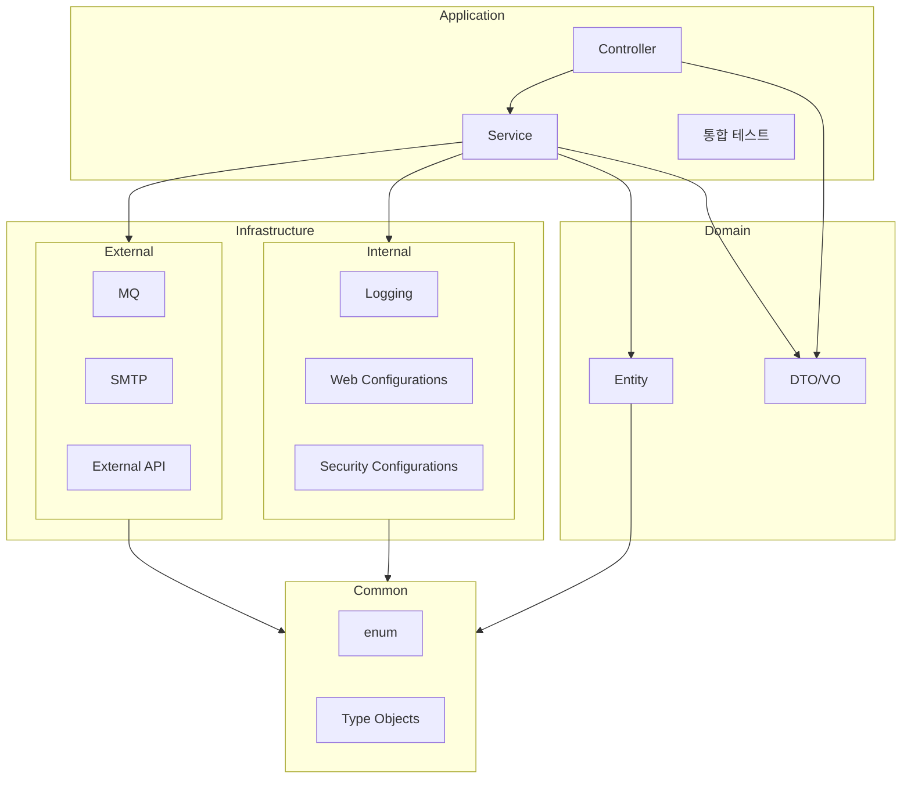

# AGENTS.md — booking

> 사람용 README 아님. **사실만**, **짧게**, **삭제 우선**. 모호/불명은 **“확인 불가”**로 표기.

## 0) 골든룰

* 프롬프트 장황 금지. **지시만** 적고 설명은 최대한 생략.
* **계획/사고 지시(think harder, plan, chain-of-thought)** 금지. Agent가 알아서 함.
* **툴은 기본 `apply_patch`만 사용.** 외부 편집/파일 매니퓰레이션 툴 지양.
* 라이브러리 지시가 필요하면 **이름만**(예: “use Querydsl”).
* **사실 우선, 추측 금지.** 근거 파일이 없으면 “확인 불가”.
* 충돌 시 **`docs/specs/policy/application.md`** 우선.

## 1) 스코프

* 멀티 모듈. 근거: `settings.gradle`.
* 아래의 구조를 따름



## 2) 신뢰 근거(Sources of Truth)

* 정책 최상위: `docs/specs/policy/application.md`
* 도메인 개요: `docs/specs/domain.md`
* API: `docs/specs/api/*.md`
* 테스트 정책: `docs/specs/policy/test.md`
* 빌드/도구: `build.gradle`, `gradle/wrapper/*`
* 설정: `application/src/main/resources/application*.yml`

## 3) 빌드/실행

```bash
./gradlew clean build        # 빌드
./gradlew test               # 테스트 (JUnit Platform)
./gradlew bootRun            # 로컬 실행
```

* Java 21, Gradle Wrapper 8.14.3, Spring Boot 3.5.4 (근거: `build.gradle`, wrapper).
* 기본 프로필: `local` (`application.yml`).

## 4) 아키텍처 규칙(요지)

* **헥사고날**: adapter → app(ports/services/persist) → domain.
* domain: 프레임워크 비의존. app만 의존 가능.
* Spring Data JPA 리포지토리 위치: `app/persist` (근거: 코드/문서 일치).
* 아키텍처 테스트: `application/src/test/java/org/mandarin/booking/arch/ModuleDependencyRulesTest.java`.

## 5) 보안(요지)

* Spring Security + JWT. `internal/src/main/java/org/mandarin/booking/adapter/*`(SecurityConfig/JwtFilter/Handlers),
  `application/src/main/java/org/mandarin/booking/adapter/security/ApplicationAuthorizationRequestMatcherConfigurer.java`
  참고.

## 6) 테스트

* 단위/통합 테스트는 JUnit5, H2(test). 자세한 기준은 `docs/specs/policy/test.md`.

## 7) 환경/프로필

* `local`, `test` 활성. `prod` 내용 비어 있음 → **확인 불가**.
* 민감정보는 **환경변수로 주입**. 예: `SPRING_DATASOURCE_*`, `JWT_TOKEN_*`.

## 8) 알려진 제한/불명

* CI/CD, 포매터(Spotless/Checkstyle), 마이그레이션(Flyway/Liquibase), Kafka/Redis/ES, 배포 스크립트: **확인 불가**.

## 9) PR 체크리스트(필수)

* [ ] `./gradlew test` 통과
* [ ] 아키텍처 테스트 통과
* [ ] 문서 최신화(`docs/specs/*`)

## 10) 금지/지양

* 장문 프롬프트, 메타지시(“더 깊게 생각해”) 추가 금지.
* apply_patch 외 임의 파일 편집 툴 지양.
* 추측성 기술 금지. 불명은 **“확인 불가”**.

## 11) `apply_patch` 사용 예

> 한 파일만 최소 변경. 설명 불요.

```patch
*** Begin Patch
*** Update File: src/main/java/org/mandarin/booking/adapter/webapi/HealthController.java
@@
 @GetMapping("/health")
 public ResponseEntity<String> health() {
-    return ResponseEntity.ok("OK");
+    return ResponseEntity.ok("OK"); // idempotent health check
 }
*** End Patch
```

## 12) 빠른 참조(경로)

* 엔트리포인트: `application/src/main/java/org/mandarin/booking/BookingApplication.java`
* Web API: `application/src/main/java/org/mandarin/booking/adapter/webapi/*`
* Security: `internal/src/main/java/org/mandarin/booking/adapter/*` (+
  `application/.../adapter/security/ApplicationAuthorizationRequestMatcherConfigurer.java`)
* App/Ports/Persist: `application/src/main/java/org/mandarin/booking/app/*`
* Domain: `domain/src/main/java/org/mandarin/booking/domain/*`

---

**메모**: 위 항목 외의 지시/템플릿/서술은 제거하십시오. 필요한 경우에만 최소한으로 추가하세요.
