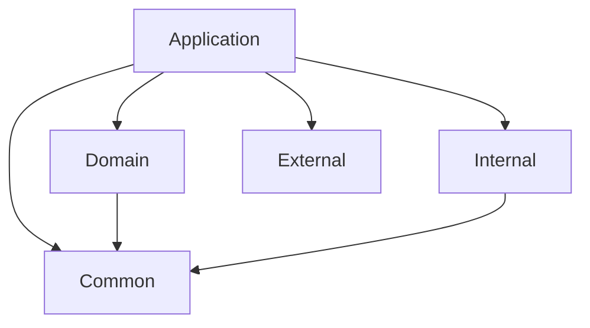
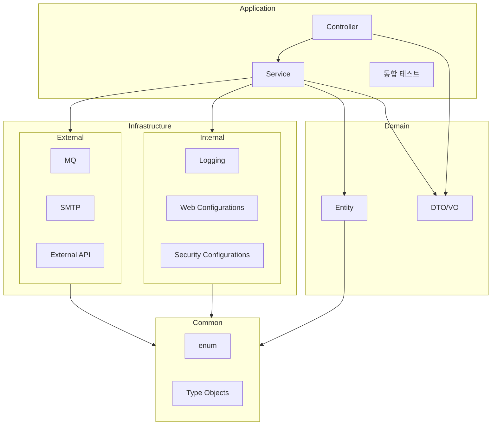

## 예찬

프로젝트 전반의 구조에 대해 확장 가능성이 충분히 존재할것으로 예상되어 빌드 구조적, 도메인 개념적 구조화된 분리를 할 필요성이 있다고 느껴져 모듈화 작업을 진행했다.

기존의 싱글모듈 프로젝트에서 멀티모듈로 전환하는 과정을 거쳤다. 변경된 모듈 구조는 아래와 같다.

Root: 프로젝트 최상단. 모든 모듈에게 공통적으로 사용되는 의존성을 관리한. test, lombok, null-safety 관련 의존성이 존재한다.

- Internal: 애플리케이션 내부의 생태계를 관리한다. 직접적인 비즈니스 관리영역이 아닌 '애플리케이션' 자체를 관리한다. 로그 설정, web 설정, 보안 설정등 비즈니스 요구사항을 직접적으로 나타내지 않는
  구현들이 존재한다.
- External: 외부 세계와의 통신을 담당한다. 도메인 로직은 물론 애플리케이션과도 완전 독립적인 모듈이다. MQ, STMP등등에 대한 기능의 구현이 존재한다.
- Domain: 비즈니스 영역의 핵심이 되는 영역이다. 비즈니스를 해결하기 위한 도메인 그 자체를 의미하며 도메인 개념을 로직으로 풀어나가는 영역이다. Entity와 통신 객체들이 여기에 해당한다.
- Common: 공통코드들을 관리한다. 파급효과가 가장 큰 영역인 만큼 라이브러리 사용을 방지하고 POJO 스타일을 원칙으로 한다. 상수와 type object들이 존재한다.
- Application: 모든 영역들을 통합해 애플리케이션을 만들어 관리한다. Spring boot의 main class가 존재하며, 각 모듈들을 통합해 비즈니스 요구사항을 해결한다. 비즈니스 로직을 해결하는
  영역과 이를 전달하는 영역으로 대부분의 Service 영역과 Controller영역, 그리고 통합 테스트가 존재한다.

그래서 모듈 구조를 정리해보자면,

조금더 영역을 나눠본다면 다음과 같을것이다.

참고로 테스트는 따지자면 그 어떤 영역에도 의존하지 않아야한다. 테스트는 만들어진 기능의 가장 첫 사용자이기 때문에 원칙대로라면 그 어떤 모듈에도 의존하지 않아야한다. 다만 개발 편의를 위해 일부 의존된 부분이
있으니 어느정도 수용하고 넘어갈 수 있는 부분인거 같다.

그리고 이제 패키지와 모듈 관계를 정리하며 외부와 소통할 클래스만 public을 사용한다. java의 클래스 기본 접근 제한자가 package-private인 이유는 필요한 기능들에 대해서만 외부에 노출하고 그
외에는 외부에서 신경쓰지 않도록 하기 위해서다. 그 의도에 맞게 적당히 필요한 경우에만 public을 사용하고 나머지는 package-private으로 유지한다.
