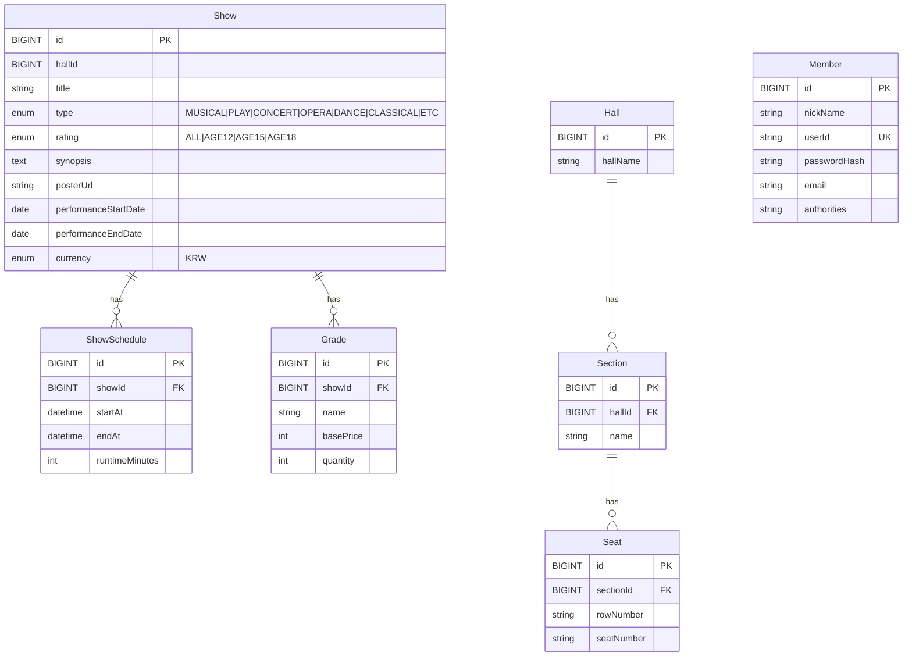

# 공연 예매 시스템 도메인 설계

## 개요

이 문서는 공연 예매 시스템의 도메인 모델 설계 및 주요 유스케이스 흐름을 설명합니다.
설계는 도메인 모델 패턴을 따르며, 다음 원칙을 강제합니다.

- AR 내부 연관은 FK 사용 허용
- AR 간 연관은 "간접 참조(식별자)"만 사용(FK 불허, via XId)
- Show 공연 기간 명확화: performanceStartDate, performanceEndDate(또는 값객체 PerformanceWindow) 사용

---

# 공연 예매 시스템 도메인 설계

---

## 공연(Show)

_Aggregate Root_

- 공연 작품 자체

#### 속성

- 제목(title)
- 유형(type: MUSICAL, PLAY, CONCERT, OPERA, DANCE, CLASSICAL, ETC)
- 관람등급(rating: ALL, AGE12, AGE15, AGE18)
- 줄거리(synopsis)
- 포스터 URL(posterUrl)
- 공연 시작일(performanceStartDate, yyyy-MM-dd)
- 공연 종료일(performanceEndDate, yyyy-MM-dd)
- 공연 스케줄(schedules: List\<ShowSchedule>)
- 통화(currency: KRW)
- 등급(grades: List\<Grade>)

#### 행위

- `create(command: ShowCreateCommand)`: 공연 생성
- `registerSchedule(hallId, startAt, endAt)`: 공연에 스케줄 등록

#### 관련 타입

- `ShowCreateCommand`
    - title, type, rating, synopsis, posterUrl, performanceStartDate, performanceEndDate, currency, ticketGrades
- `ShowRegisterRequest` / `ShowRegisterResponse`

---

### 회차(ShowSchedule)

_Entity_

- 특정 공연이 특정 홀에서 특정 시간에 진행되는 스케줄

#### 속성

- showId(FK)
- hallId
- 시작일시(startAt)
- 종료일시(endAt)
- 상영시간(runtimeMinutes)

---

### 홀(Hall)

- 공연 시설

#### 속성

- 이름(name)
- 등록자ID(registantId)

---

### 구역(Section)

_Entity_

- 홀 내부의 구역
    - ex) A관

#### 속성

- hallId(FK)
- 이름(name)

---

### 좌석(Seat)

_Entity_

- 홀 내부의 개별 좌석

#### 속성

- sectionId(FK)
- 열(rowNumber)
- 번호(seatNumber)

---

### 등급(Grade)

_Entity_

- 쇼 단위 좌석 등급(가격/수량 포함)

#### 속성

- showId(FK)
- 이름(name) — 쇼 내 유니크
- 기본가격(basePrice)
- 수량(quantity)

---

<!-- 가격표/가격행: 현재 구현 범위 밖 (확인 불가) -->

## 회원(Member)

_Aggregate Root_

- 서비스를 사용하는 회원

#### 속성

- 닉네임(nickName)
- 아이디(userId, UNIQUE)
- 비밀번호(passwordHash)
- 이메일(email)
- 권한(authorities: USER, DISTRIBUTOR, ADMIN)

#### 행위

- `register(command: MemberRegisterCommand, encoder)`
- `changeNickName(newNickName)`
- `changeEmail(newEmail)`
- `matchesPassword(rawPassword, encoder)`

#### 관련 타입

- `MemberRegisterCommand`
- `MemberRegisterRequest` / `MemberRegisterResponse`

---

