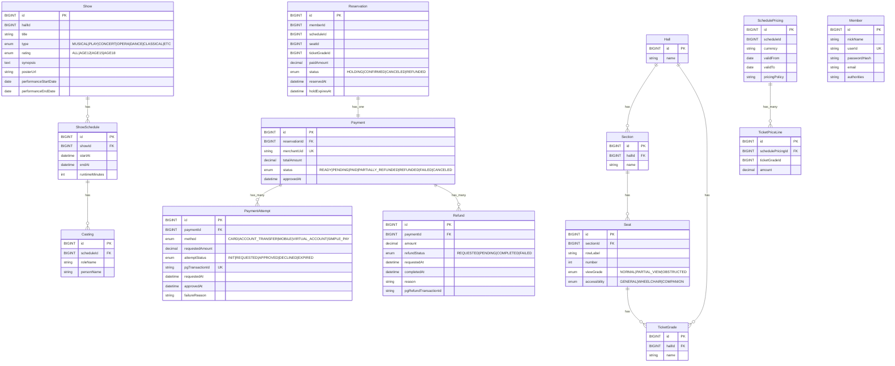

# 공연 예매 시스템 도메인 설계

## 개요

이 문서는 공연 예매 시스템의 도메인 모델 설계 및 주요 유스케이스 흐름을 설명합니다.
설계는 도메인 모델 패턴을 따르며, 다음 원칙을 강제합니다.

- AR 내부 연관은 FK 사용 허용
- AR 간 연관은 "간접 참조(식별자)"만 사용(FK 불허, via XId)
- 결제 도메인 분리 없음: Reservation AR 내부에 Payment/PaymentAttempt/Refund 포함
- Show 공연 기간 명확화: performanceStartDate, performanceEndDate(또는 값객체 PerformanceWindow) 사용

---

# 공연 예매 시스템 도메인 설계

---

## 공연(Show)

_Aggregate Root_

- 공연 작품 자체

#### 속성

- 제목(title)
- 유형(type: MUSICAL, PLAY, CONCERT, OPERA, DANCE, CLASSICAL, ETC)
- 관람등급(rating: ALL, AGE12, AGE15, AGE18)
- 줄거리(synopsis)
- 포스터 URL(posterUrl)
- 공연 시작일(performanceStartDate, yyyy-MM-dd)
- 공연 종료일(performanceEndDate, yyyy-MM-dd)
- 공연 스케줄(schedules: List\<ShowSchedule>)

#### 행위

- `create(command: ShowCreateCommand)`
- `registerSchedule(hallId, startAt, endAt)`

#### 관련 타입

- `ShowCreateCommand`
    - title, type, rating, synopsis, posterUrl, performanceStartDate, performanceEndDate
- `ShowRegisterRequest` / `ShowRegisterResponse`

---

### 회차(ShowSchedule)

_Entity_

- 특정 공연이 특정 홀에서 특정 시간에 진행되는 스케줄

#### 속성

- showId(FK)
- hallId
- 시작일시(startAt)
- 종료일시(endAt)
- 상영시간(runtimeMinutes)

---

### 캐스팅(Casting)

_Entity_

- 회차별 배역과 출연자 매핑

#### 속성

- scheduleId(FK)
- 배역명(roleName)
- 출연자명(personName)

---

### 홀(Hall)

- 공연 시설

#### 속성

- 이름(name)

---

### 좌석(Seat)

_Entity_

- 홀 내부의 개별 좌석

#### 속성

- hallId(FK)
- 열(rowLabel)
- 번호(number)
- 시야등급(viewGrade: NORMAL, PARTIAL_VIEW, OBSTRUCTED)
- 접근성(accessibility: GENERAL, WHEELCHAIR, COMPANION)

---

### 좌석등급(TicketGrade)

_Entity_

- 홀 단위 좌석 등급

#### 속성

- hallId(FK)
- 이름(name)

---

## 가격표(SchedulePricing)

_Aggregate Root_

- 회차와 좌석등급 조합에 따른 가격 관리

#### 속성

- scheduleId
- 통화(currency)
- 시작일(validFrom)
- 종료일(validTo)
- 가격정책(pricingPolicy)

#### 행위

- `createFor(scheduleId, currency, validFrom, validTo)`
- `putPrice(ticketGradeId, amount)`
- `removePrice(ticketGradeId)`

#### 관련 타입

- `CreateSchedulePricingCommand`
- `PutTicketPriceCommand`

---

### 가격행(TicketPriceLine)

_Entity_

- 가격표의 라인 항목

#### 속성

- schedulePricingId(FK)
- ticketGradeId
- 금액(amount)

---

## 회원(Member)

_Aggregate Root_

- 서비스를 사용하는 회원

#### 속성

- 닉네임(nickName)
- 아이디(userId, UNIQUE)
- 비밀번호(passwordHash)
- 이메일(email)
- 권한(authorities: USER, DISTRIBUTOR, ADMIN)

#### 행위

- `register(command: MemberRegisterCommand, encoder)`
- `changeNickName(newNickName)`
- `changeEmail(newEmail)`
- `matchesPassword(rawPassword, encoder)`

#### 관련 타입

- `MemberRegisterCommand`
- `MemberRegisterRequest` / `MemberRegisterResponse`

---

## 예매(Reservation)

_Aggregate Root_

- 좌석 보류, 확정, 환불 및 결제 관리

#### 속성

- memberId
- scheduleId
- seatId
- ticketGradeId
- 상태(status: HOLDING, CONFIRMED, REFUNDED, CANCELED)
- 예매일시(reservedAt)
- 홀드만료일시(holdExpiresAt)
- 결제금액(paidAmount)

#### 행위

- `hold(memberId, scheduleId, seatId, ticketGradeId, ttl)`
- `readyPayment(merchantUid, totalAmount)`
- `confirmPaid(merchantUid, approvedAt)`
- `cancelBeforeConfirm()`
- `requestRefund(amount, reason)`

#### 관련 타입

- `HoldReservationCommand`
- `ReadyPaymentCommand`
- `ConfirmPaidCommand`
- `RequestRefundCommand`

---

### 결제(Payment)

_Entity_

- Reservation에 종속되는 결제 정보

#### 속성

- reservationId(FK)
- 상점거래ID(merchantUid, UNIQUE)
- 총액(totalAmount)
- 상태(status: READY, PENDING, PAID, PARTIALLY_REFUNDED, REFUNDED, FAILED, CANCELED)
- 승인일시(approvedAt)

---

### 결제시도(PaymentAttempt)

_Entity_

- 결제 요청 및 승인/실패 내역

#### 속성

- paymentId(FK)
- 결제수단(method: CARD, ACCOUNT_TRANSFER, MOBILE, VIRTUAL_ACCOUNT, SIMPLE_PAY)
- 요청금액(requestedAmount)
- 상태(attemptStatus: INIT, REQUESTED, APPROVED, DECLINED, EXPIRED)
- PG거래ID(pgTransactionId, UNIQUE)
- 요청일시(requestedAt)
- 승인일시(approvedAt)
- 실패사유(failureReason)

---

### 환불(Refund)

_Entity_

- 환불 내역

#### 속성

- paymentId(FK)
- 환불금액(amount)
- 상태(refundStatus: REQUESTED, PENDING, COMPLETED, FAILED)
- 요청일시(requestedAt)
- 완료일시(completedAt)
- 사유(reason)
- PG환불거래ID(pgRefundTransactionId)

