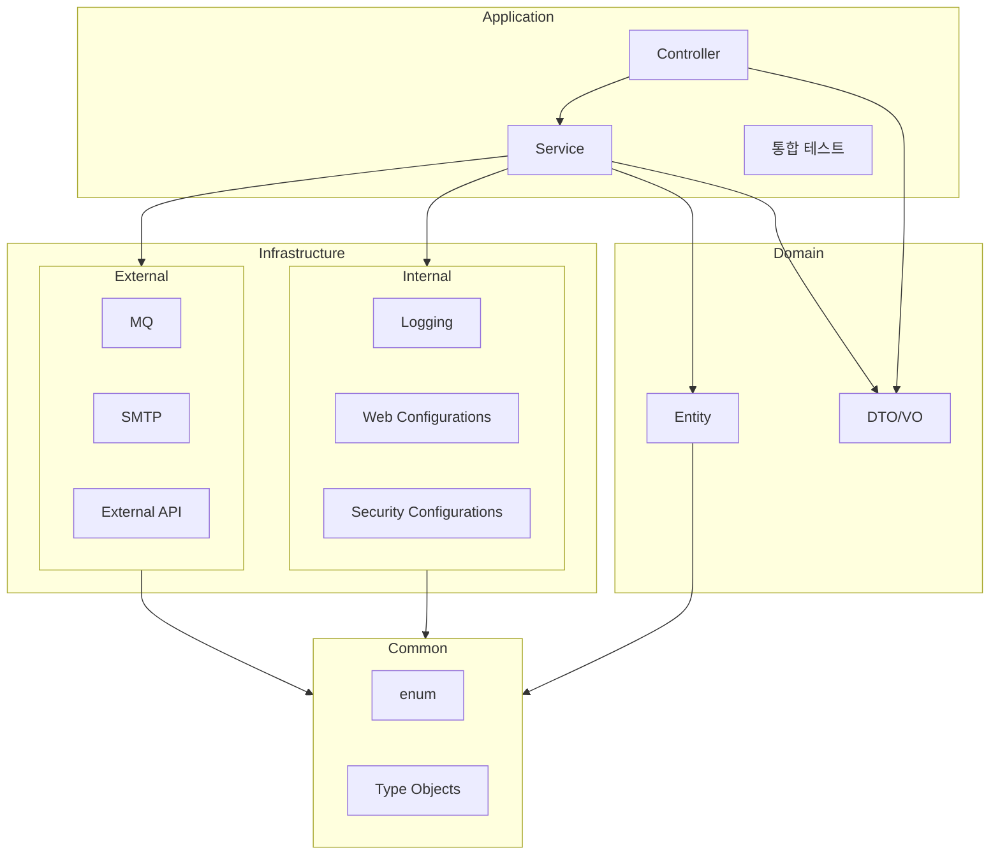

# 애플리케이션 아키텍처 규칙(헥사고날 아키텍처)

본 문서는 booking 프로젝트가 채택한 헥사고날 아키텍처(Hexagonal Architecture, Ports & Adapters)의 규칙을 명확히 하기 위한 가이드입니다. 이 문서는 아키텍처 테스트와 코드
리뷰의 근거가 되며, 새로운 기능 추가 시 반드시 준수해야 합니다.

## 1. 계층과 책임

프로젝트는 크게 세 계층으로 구성됩니다.

- domain 모듈

---

- common 모듈
- **위치**: `./common`
- **책임**: 모든 모듈이 공통적으로 사용할 수 있는 순수 코드
    - Enum
    - Type Object
- **특징**:
    - 외부 라이브러리 의존 금지
    - POJO 스타일 유지

---

- domain 모듈
- **위치**: `./domain`
- **책임**: 비즈니스 핵심 모델과 규칙
    - Entity
    - DTO/VO
- **의존성**: Common 모듈에만 의존 가능

---

- Internal 모듈

- **위치**: `./internal`
- **책임**: 애플리케이션 내부 생태계 관리
    - Logging
    - Web Configurations
    - Security Configurations
- **의존성**: Common 모듈에 의존 가능
- External 모듈
- **위치**: `./external`
- **책임**: 외부 세계와의 연결
    - MQ
    - SMTP
    - External API
- **의존성**: Common 모듈에 의존 가능

---

## 4. Application 모듈

- **위치**: `./application`
- **책임**: 애플리케이션 통합 및 유스케이스 실행
    - Controller
    - Service
    - 통합 테스트
- **의존성**
    - Domain 모듈
    - Common 모듈
    - Internal 모듈
    - External 모듈

---

## 2. 의존성 규칙

- domain -> another domain
- application -> domain (OK), adapter (금지)
- adapter -> application 포트(OK), application 서비스/구현(금지), domain(읽기 전용 OK. 단, 비즈니스 수행은 application 경유)
- DTO/엔티티 경계:
    - webapi의 요청/응답 DTO는 한시적으로 domain에 존재. 추후 변경 가능성 있음.
    - 영속성 엔티티는 domain에만 존재. domain 엔티티와 동일 클래스로 사용.

## 3. 포트와 어댑터

- 입력 포트(inbound port): 유스케이스 인터페이스. 위치: `application/app/*`.
- 출력 포트(outbound port): 외부 시스템/리포지토리에 대한 인터페이스. 위치: `application/app/*` 하위에 정의.
- 어댑터(adapters): 포트 인터페이스의 구현체. 위치: `application/adapter/*` 등. 현재 JPA 기반 구현은 `application/app/*Repository`를 통해 동작하며 해당
  패키지는 어댑터 계층으로 간주.

권장 네이밍:

- 입력 포트: UseCase 동사형 + er (예: Registerer, UseCase)
- 출력 포트: 리소스 + 동작 + Repository/Gateway (예: ShowCommandRepository)
- 그 외에는 해당 인터페이스가 담당한 기능의 추상적 개념을 나타내는 네이밍

## 4. 트랜잭션/검증/예외/로깅 규칙

- 트랜잭션 경계: application 계층의 유스케이스 서비스 메서드 수준에서 관리(`@Transactional`). 컨트롤러/어댑터에서는 트랜잭션을 시작하지 않습니다.
- 검증:
    - 형태/구문 검증: adapter(webapi)에서 기본적인 바인딩/형식 검증 허용.
    - 비즈니스/정책 검증: application 또는 domain에서 수행. `Validator` 등의 컴포넌트는 application에 위치.
- 예외:
    - 도메인 오류는 domain 예외(`DomainException`의 자식 클래스)로 표현.
    - 어댑터/기술 오류는 해당 계층에서 포착하고 domain 의미의 예외로 변환 또는 적절히 매핑.
    - webapi는 예외를 `GlobalExceptionHandler`로 공통 변환하여 `ErrorResponse`로 응답.
- 로깅: 크로스커팅은 internal 계층의 AOP(`LoggingAspect`)에서 처리. 민감 정보(비밀번호, 토큰 등)는 로그 금지.

## 5. 모듈 구조 규칙

- internal: 애플리케이션 내부의 생태계를 관리한다. 직접적인 비즈니스 관리영역이 아닌 '애플리케이션' 자체를 관리한다. 로그 설정, web 설정, 보안 설정등 비즈니스 요구사항을 직접적으로 나타내지 않는
  구현들이 존재한다.
- external: 외부 세계와의 통신을 담당한다. 도메인 로직은 물론 애플리케이션과도 완전 독립적인 모듈이다. MQ, STMP등등에 대한 기능의 구현이 존재한다.
- domain: 비즈니스 영역의 핵심이 되는 영역이다. 비즈니스를 해결하기 위한 도메인 그 자체를 의미하며 도메인 개념을 로직으로 풀어나가는 영역이다. Entity와 통신 객체들이 여기에 해당한다.
- common: 공통코드들을 관리한다. 파급효과가 가장 큰 영역인 만큼 라이브러리 사용을 방지하고 POJO 스타일을 원칙으로 한다. 상수와 type object들이 존재한다.
- application: 모든 영역들을 통합해 애플리케이션을 만들어 관리한다. Spring boot의 main class가 존재하며, 각 모듈들을 통합해 비즈니스 요구사항을 해결한다. 비즈니스 로직을 해결하는
  영역과 이를 전달하는 영역으로 대부분의 Service 영역과 Controller영역, 그리고 통합 테스트가 존재한다.

### 5.1 모듈간 의존관계

## 6. 컨트롤러와 DTO 변환 규칙

- 컨트롤러는 입력 포트만 의존한다.
- 요청 DTO -> domain/application 요청 모델로 변환 후 유스케이스 호출.
- 유스케이스 반환값 -> web DTO로 매핑하여 응답한다.
- 컨트롤러에서 비즈니스 로직/트랜잭션 처리 금지.

예시(공연 등록):

- `adapter/webapi/ShowController` -> `application/port/ShowRegisterer` 호출
- `domain.show.ShowRegisterRequest`/`ShowCreateCommand` 사용하여 유스케이스 실행
- 결과를 `domain.show.ShowRegisterResponse` 받아 web 응답으로 래핑(`ApiResponse`)

## 7. 영속성 규칙(JPA)

- JPA 엔티티는 domain에, Repository는 application(persist)에만 존재.
- application 계층은 JPA 구체 타입에 의존하지 않고, 출력 포트 인터페이스를 통해서만 데이터 접근.
- 매핑 책임은 어댑터에 위치: JPA 엔티티 <-> 도메인 엔티티/모델 변환.

## 8. 보안 규칙

- 인증/인가 컴포넌트 위치:
    - `internal/adapter`: `SecurityConfig`, `JwtFilter`, `CustomAuthenticationEntryPoint`, `CustomAccessDeniedHandler`,
      `TokenUtils`
    - `application/adapter/security`: `ApplicationAuthorizationRequestMatcherConfigurer`
    - `application/app/member`: `CustomAuthenticationProvider`
- 보안 컨텍스트/토큰 파싱은 어댑터에서 처리하고, application 유스케이스에는 인증된 식별자/역할만 전달.

## 9. 테스트 규칙

- `application/src/test/java/org/mandarin/booking/arch/ModuleDependencyRulesTest.java` 는 아키텍처 규칙을 자동 검증합니다.
- 규칙 위반 예:
    - adapter가 application 서비스 구현 클래스에 직접 의존
    - application이 adapter 패키지에 의존
  - domain이 프레임워크에 의존
- 새로운 모듈/클래스 추가 시 해당 테스트가 통과하는지 반드시 확인합니다.

## 10. 확장 가이드(새 유스케이스/어댑터 추가)

새 유스케이스(예: 공연 수정) 추가 절차:

1) domain에 필요한 모델/명세 정의(예: `ShowUpdateCommand`).
2) application/port에 입력 포트 정의(예: `ShowUpdater`).
3) application에 서비스 구현(`ShowService` 내 메서드 또는 별도 서비스) 및 트랜잭션/검증 구현.
4) 필요 시 출력 포트 정의 및 어댑터 구현(persist/JPA 등).
5) adapter/webapi에 컨트롤러 엔드포인트 추가 및 DTO 매핑.
6) 아키텍처/통합 테스트 통과 확인.

새 어댑터(예: 외부 결제 API) 추가 절차:

1) application에 출력 포트 인터페이스 추가(예: `PaymentGateway`).
2) adapter 하위에 구현(예: `adapter/external/PaymentGatewayHttpClient`).
3) 구성(Security/Config)과 예외 매핑 추가.

## 11. 공통 규칙 요약(Do/Don’t)

Do

- 유스케이스 입출력은 application 포트를 통해서만 노출/호출한다.
- 도메인 모델은 순수하게 유지한다(프레임워크 의존 금지).
- 어댑터는 포트 인터페이스를 구현한다.
- 트랜잭션과 로깅은 application에서 관리한다.

Don’t

- 컨트롤러에서 비즈니스 로직 수행 금지.
- application에서 adapter 패키지/구현에 의존 금지.
- domain에서 JPA/Spring 등에 의존 금지.
- 모듈간 의존관계를 위배하는 구현 금지.

## 12. 용어

- 도메인 모델: 비즈니스 개념을 표현하는 순수 객체(`Member`, `Show` 등)
- 유스케이스: 시스템이 제공하는 기능 단위(등록, 로그인 등)
- 포트: 유스케이스(입력) 또는 외부 의존(출력)을 추상화한 인터페이스
- 어댑터: 포트를 구현하여 외부 세계와 연결하는 기술 계층

본 문서는 변경 시 PR에 포함하고, 아키텍처 테스트가 통과하는지 확인해야 합니다.
